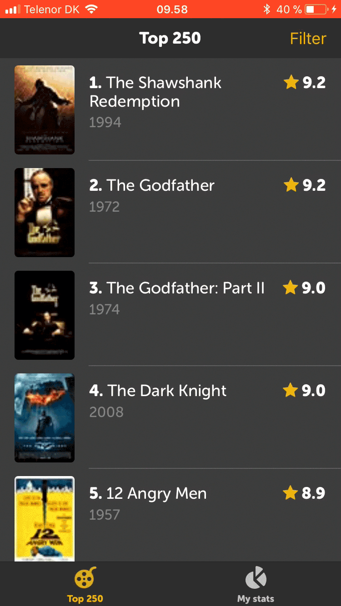
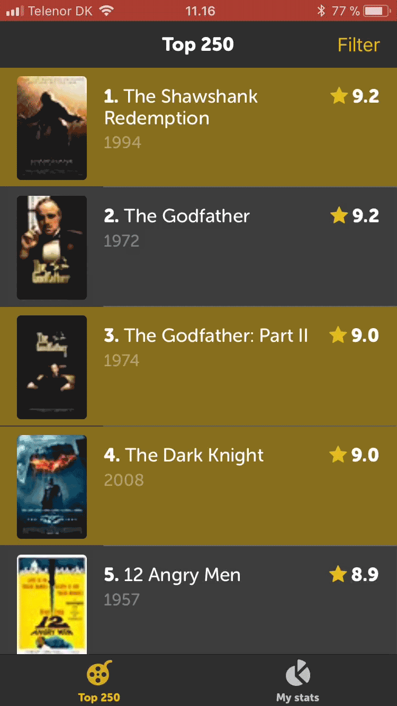
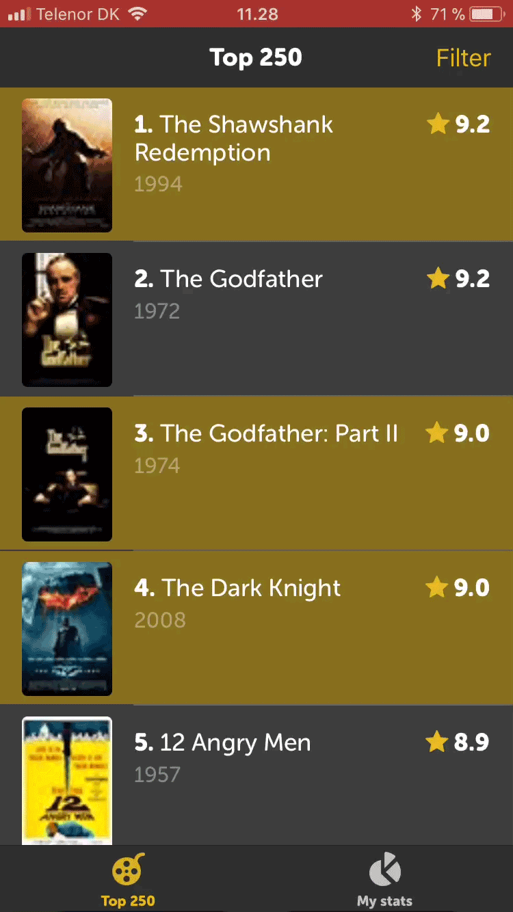

# Learning React Native

Top 250 is a pet-project I recently build to learn React Native including the following technologies:
- Redux
- Containers and Presentational Components
- Animated API and PanResponder
- Async fetching from API

The app has:
- An onboarding tooltip
- A list of IMDb's top 250
- A filter page
- A page showing statistics

# Preview

    
    
    
    

